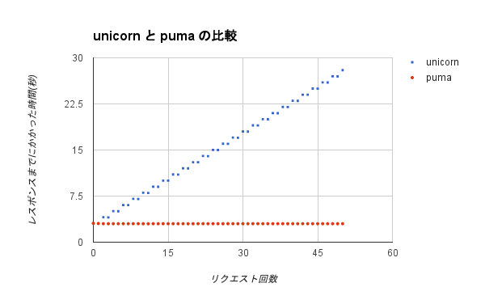

# unicorn と puma の比較

レスポンスを返すまでに数秒間かかるようなアプリケーションの場合、
unicorn を使用していると急激に遅くなるケースがあります。
そういう場合には puma などを使用するのが良さそうです。

> unicorn はプロセスモデルのサーバであり、blocking I/O モデルを採用しています。つまり、クライアントとの通信中プロセスが専有されるということです。例えば unicorn がワーカプロセスを3つ立ち上げていて、そこへ通信完了に10分かかるようなスロークライアントが3つ接続されたら…、続くクライアントはスロークライアントの通信が完了するまで実行を待たなければならなくなります。プロセスの数をもっと増やせば対応できますが、それはその分メモリやサーバ台数、最終的には月額のサーバ費用に影響を与えます。

> 引用元: http://blog.willnet.in/entry/2015/02/24/155006

## ベンチマークに使用したコード

レスポンスを返すまでに3秒程度かかるエンドポイントを用意しました。
詳細はこの repo に置いてあるソースコードを見て下さい。

```ruby
# app.rb

require 'sinatra'
require 'sinatra/json'

get '/' do
  sleep 3
  result = { result: "ok" }
  json result
end
```

## 調査結果



| リクエスト回数 | unicorn   | puma     |
|----------------|-----------|----------|
| 0              | 3.05587   | 3.063774 |
| 1              | 3.030757  | 3.039139 |
| 2              | 4.052821  | 3.006948 |
| 3              | 4.031208  | 3.003746 |
| 4              | 5.053297  | 3.006855 |
| 5              | 5.028297  | 3.007021 |
| 6              | 6.046615  | 3.005166 |
| 7              | 6.025575  | 3.004437 |
| 8              | 7.045507  | 3.005796 |
| 9              | 7.020947  | 3.006756 |
| 10             | 8.040334  | 3.002674 |
| 11             | 8.015714  | 3.002512 |
| 12             | 9.035137  | 3.002347 |
| 13             | 9.010704  | 3.004656 |
| 14             | 10.027458 | 3.004699 |
| 15             | 10.00627  | 3.006794 |
| 16             | 11.02476  | 3.006693 |
| 17             | 11.005164 | 3.006769 |
| 18             | 12.023319 | 3.006831 |
| 19             | 12.00605  | 3.002192 |
| 20             | 13.019327 | 3.002857 |
| 21             | 13.000185 | 3.002258 |
| 22             | 14.018656 | 3.006906 |
| 23             | 14.001615 | 3.004743 |
| 24             | 15.01929  | 3.002589 |
| 25             | 14.998892 | 3.006821 |
| 26             | 16.018298 | 3.002123 |
| 27             | 15.997071 | 3.005876 |
| 28             | 17.014941 | 3.006472 |
| 29             | 16.998275 | 3.00539  |
| 30             | 18.015428 | 3.007055 |
| 31             | 17.99646  | 3.002536 |
| 32             | 19.012191 | 3.007022 |
| 33             | 18.993711 | 3.006767 |
| 34             | 20.013636 | 3.005821 |
| 35             | 19.994985 | 3.006908 |
| 36             | 21.011139 | 3.005097 |
| 37             | 20.989411 | 3.006742 |
| 38             | 22.009299 | 3.00422  |
| 39             | 21.988742 | 3.002112 |
| 40             | 23.007811 | 3.00657  |
| 41             | 22.988394 | 3.003826 |
| 42             | 24.004632 | 3.006924 |
| 43             | 23.986461 | 3.006963 |
| 44             | 25.002247 | 3.004696 |
| 45             | 24.984822 | 3.004366 |
| 46             | 26.00361  | 3.003606 |
| 47             | 25.983418 | 3.006535 |
| 48             | 26.997404 | 3.002728 |
| 49             | 26.97869  | 3.004076 |
| 50             | 27.997199 | 3.006909 |
